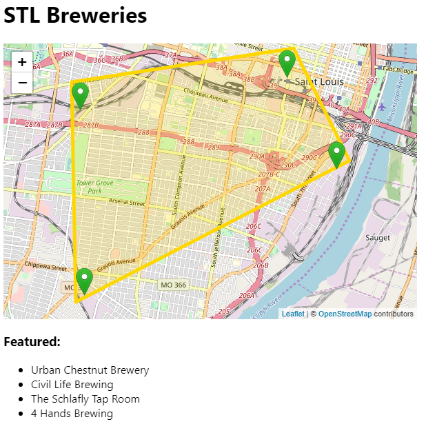

This is a practice run using open source code working with a polygon, colors, markers and popups.There are many more map markers representing breweries that could be added.
 
 
:beer: Screenshot :beer: 
 
 

 
<i>Created with CodeSandbox</i>
